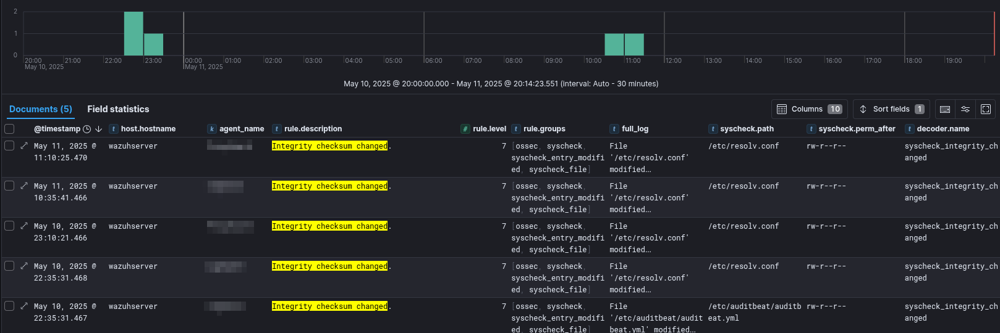

# 📊 ELK Stack – Elasticsearch & Kibana

This document explains how Elasticsearch and Kibana are used in this project, along with Filebeat, Auditbeat and Wazuh to provide real-time observability across systems.

---

## 📦 Stack Components

- **Elasticsearch 8.17.4** — stores logs and metrics with structured indexing
- **Kibana 8.17.4** — visualizes and queries the data
- **Filebeat** — forwards system logs (e.g., auth.log, clamav.log)
- **Auditbeat** — tracks system events (logins, sudo, process starts, file access)
- **Wazuh Manager** — generates structured security alerts (auth events, FIM, rules)

All logs are shipped securely to a central logging node and visualized via Kibana dashboards.

---

## 🔐 Security Considerations

- The Elasticsearch node uses a self-signed CA (`http_ca.crt`) for HTTPS transport
- All Beat agents are authenticated via API keys
- Logging node is not externally exposed and reachable only via SSH tunnel

---

## 📈 Dashboards

Below are examples of dashboards used to monitor security-relevant events.  
All screenshots are sanitized to remove sensitive fields (IPs, usernames, hostnames).

---

### 🔐 Login Attempts & SSH Activity

This dashboard shows login events, sudo usage, and failed authentication attempts.

---

### 🧾 File Integrity Monitoring (FIM)

This view highlights file changes on monitored directories (e.g., `/etc`, `/usr/bin`) and groups them by host and user.

---

### ⚙️ Process Activity & Command Execution

Collected via Auditbeat, this dashboard tracks process starts, parent/child PID chains, and command-line arguments.

---

### 🧪 Process & User Activity Tracking

Auditbeat captures detailed execution data for system processes, including who ran what, when, and how.

This includes:

- SUDO command usage (tracked via `event.action: executed`)
- User creation and deletion (tracked via user management utilities)

#### 🧍 SUDO Command Usage

Shows who used `sudo`, what commands were executed, and from which session.

#### 👥 User Add/Delete Events

Captures invocations of `useradd`, `userdel`, and similar operations that affect local account management.

---

### 🌐 Network Exposure Changes

This dashboard highlights any change in network exposure — specifically when a host starts listening on a new port or closes one that was previously open.

Detected via **Wazuh Rule ID 533**, this event helps identify:

- Unexpected services starting (e.g., netcat, rogue SSH)
- Closed services that may indicate instability or attack cleanup
- Deviations from expected service profiles

#### 🔊 Listened Port State Changes

Shows netstat diffs and affected ports for each host.

---

## 🛠️ Notes

- Dashboards are customized and exported as JSON for reproducibility
- All Beats are configured via Ansible using `config_files/{debian12,ubuntu}/` folders
- Logs are retained based on index lifecycle management (ILM)

---

## 📂 See also

- [Auditbeat configuration](../config_files/auditbeat.yml)
- [Stealth log server design](./stealth-logserver.md)
- [Tools overview](../tools-overview.md)